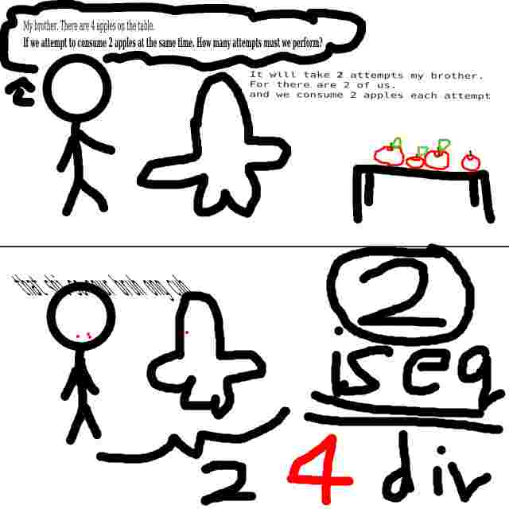

i think arguments should counted from the proximity to the function called

so it should be easier to curry

in haskell you partially apply functions with something like this right?

```
my_function = div 4
my_function 8 (returns 2)
```

so in hvll if you were to uhhh

```
(4 div) my_function =
8 my_function (is 0.5)
```
for 4 is pushed to the stack first. the closure will look something like this:

```
 (4, {not applied}, div) Closure
```
thus when you call the closure it will be something like this:

```
8 my_function = (4 8 div)
```
this means you are doing `4 / 8`

my first idea was: just do right to left supplying only when partial applocation.

```
4 div = (({not applied}, 4, div) Closure)
```

but i feel that is inconsistent

my second idea is to use `_` as a placeholder:

```
8 _ div = ((8, {not applied}, div) Closure)
```

but i think it does not look very great if i had to this all the time.

my third idea is to just do the arguments right to left

so it will be actual REVERSE polish notation
```
4 8 div (is 2)
```

are you skeptical for whatever reason? if so. i made thid drawing to     help you understand



it is okay if you still do not understand